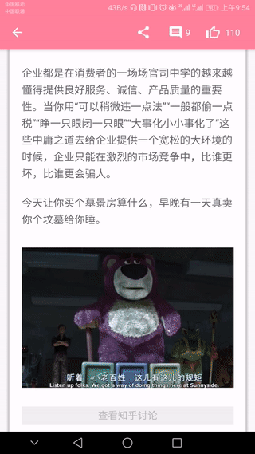

## **知汇**

### **个人练习项目:低仿知乎日报**

  * **项目架构** ：MVP+Retrofit+RxJava(部分使用了DataBinding框架)
  * **UI风格**   ：主要是Google官方推荐的Material Design
  * **语言**      ：正逐步用kotlin替换原有的Java代码（目前进度：99%）
  
----
  #### **接口数据来源**
  
  * [知乎日报-API-分析](https://github.com/izzyleung/ZhihuDailyPurify/wiki/%E7%9F%A5%E4%B9%8E%E6%97%A5%E6%8A%A5-API-%E5%88%86%E6%9E%90)
 
 
----

  #### **已有功能**
 1. 首页：知乎日报  顶部轮播图+今日热闻列表，支持上拉加载更多和下拉刷新和FAB悬浮按钮快速返回；
 
 2. 左侧拉菜单：相关主题日报的列表查看,点击后可查看相应的主题日报，内容包括：顶部背景图文字介绍+该主题的相关主编（可点击查看详情）+具体的新闻列表，同样支持上拉加载更多和FAB悬浮按钮快速返回；
 
 3. 新闻详情页面：可查看具体新闻内容+评论数目+点赞次数，点击可查看图片详情，
 
 4. 新闻评论页面：可查看该新闻的所有的长评论和短评论(最多20条)，以及查看用户对相关评论的回复

----
### **界面**

 
 
 
 
